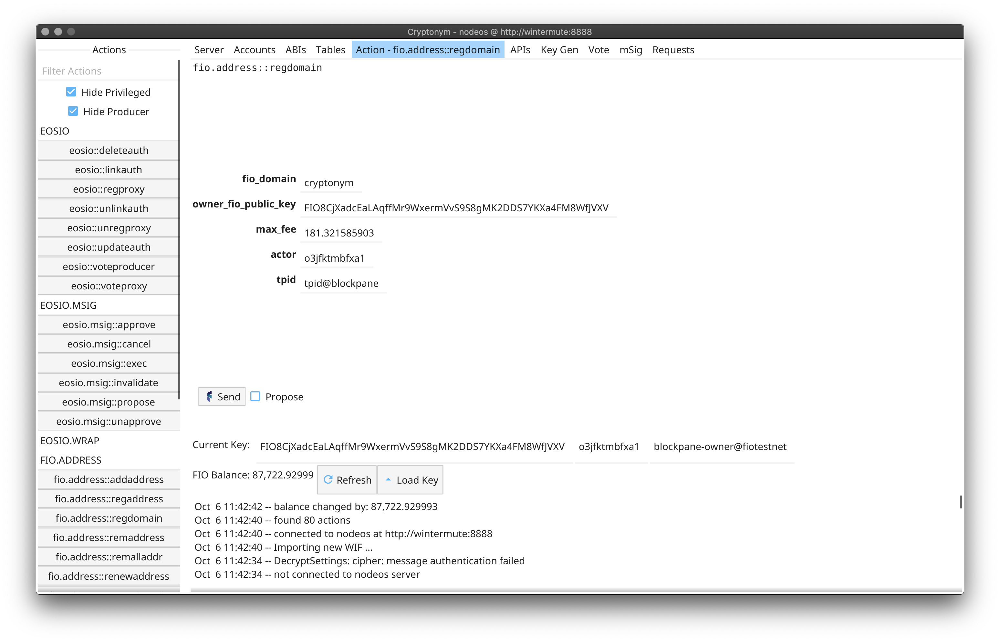
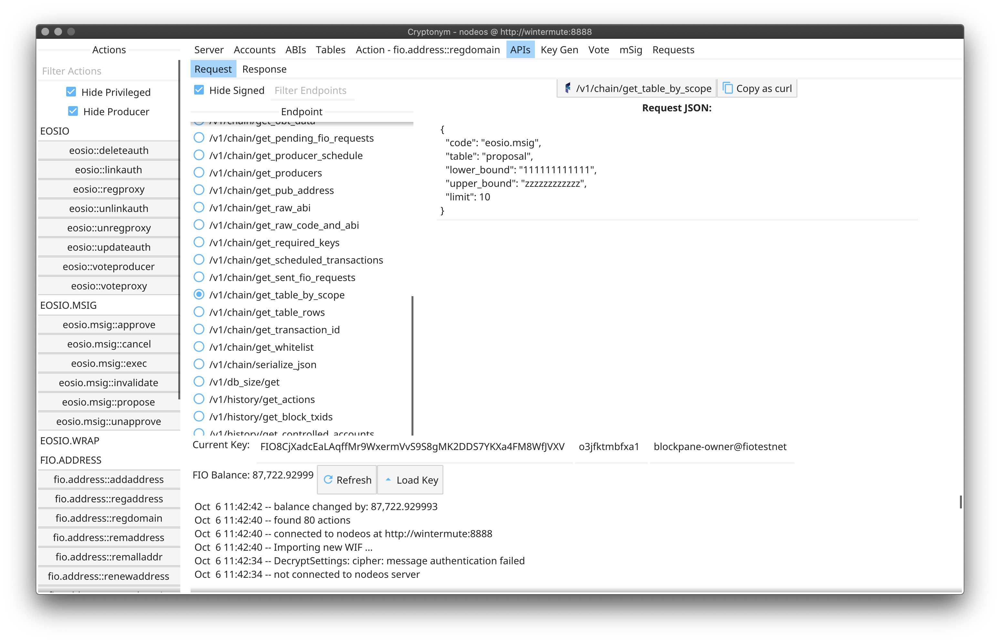
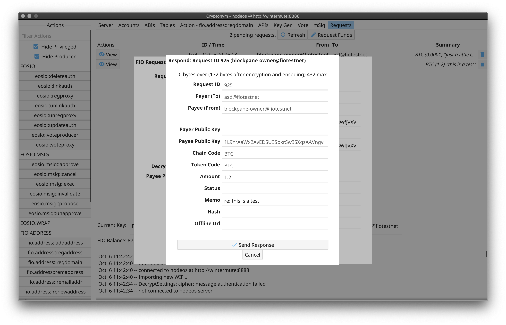
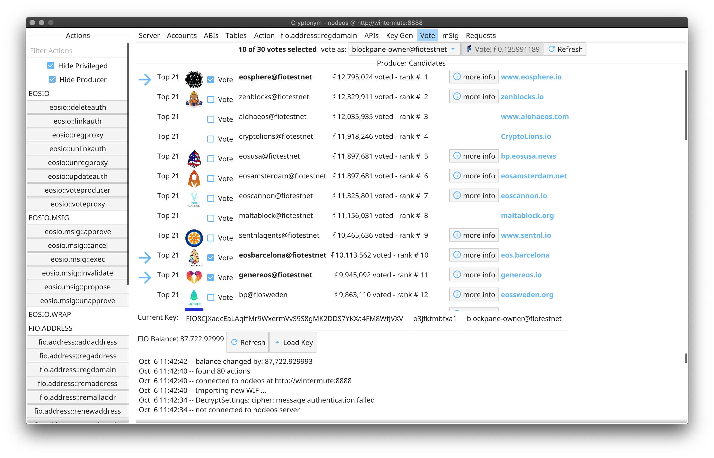

# Cryptonym

This is a utility for testing the [FIO Protocol](https://fioprotocol.io)

**This is intended for advanced users, such as developers and block-producers. Using cryptonym as a general wallet is not advised.
It is provided with no warranty, it is assumed that the user understands what they are doing and assumes all liability.**

## History

This is a tool built during the development of the FIO chain by Dapix. Originally it was developed for security testing
of contracts. Most of the attack capabilities have been removed and the FIO Foundation has graciously allowed me to
release the project for the FIO community.

## Features

 * connects to a server, and pulls a list of all accounts with an ABI
 * provides a list of these on the left side of the window
 * selecting an action will retrieve the abi for the account
 * presents an editor
 * in many cases has sensible default values
 * submission as a msig-proposal
 * a viewer pops up to see both the request and response.

Other useful abilities:

 * retrieves a list of available api endpoints, and presents a form for sending requests directly
 * a key generator, with vanity key generation
 * some limited msig functionality, for now only a form for update-auth to create and ability to propose. viewing, rejecting, approving and cancel abilities are planned
 * account lookup, by pub key, fio address, fio domain, private key, or account
 * table browser for viewing data
 * abi viewer
 * bp voting tool
 * ability to view pending FIO requests, reject, respond, or request funds. (Handling sent requests is not yet available.)

**Advanced-mode offers additional functionality when sending actions.**

 *Using the advanced features will not normally be useful for sending transactions and is disabled by default.*

 * The editor has additional options
   - changing abi field types
   - using various fuzzers to generate data
   - performs as little error checking as possible (within limitations of being able to serialize)
   - includes many features to modify the request
 * requests can be sent in batches/loops. WARNING: this can quickly deplete funds.


### Action Editor



### API



### FIO Requests



### Voting



## Note on building ...

* Requires Go v1.14 or higher.
* This is built with the Fyne windowing toolkit, which requires several libraries to be installed:
  - [Fyne Requirements](https://developer.fyne.io/started/#prerequisites)

To build and install, clone this repo, and run ...

```
cryptonym$ go install ./...
```

And the binary `cryptonym-wallet` will be placed inside `$GOPATH/bin` (most likely `~/go/bin`)

